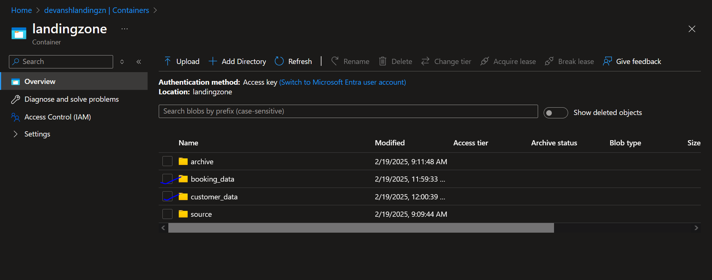
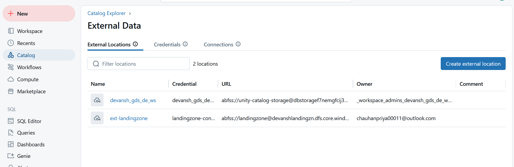
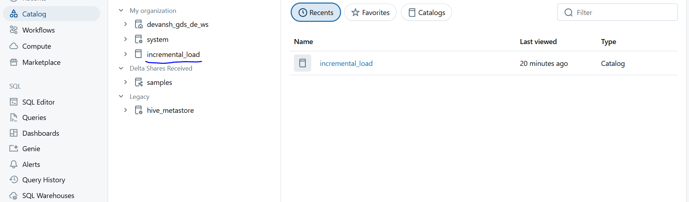
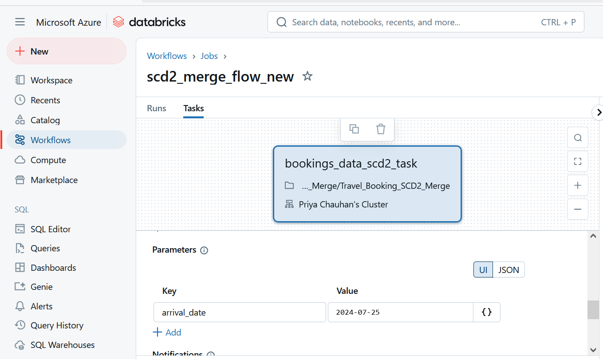
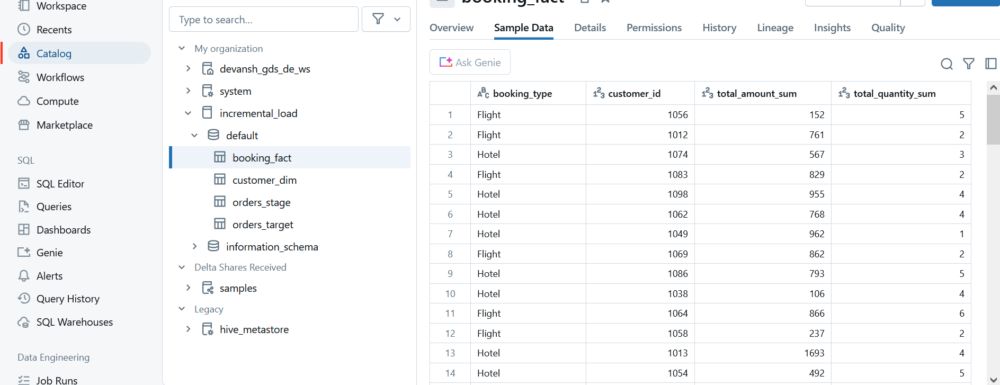
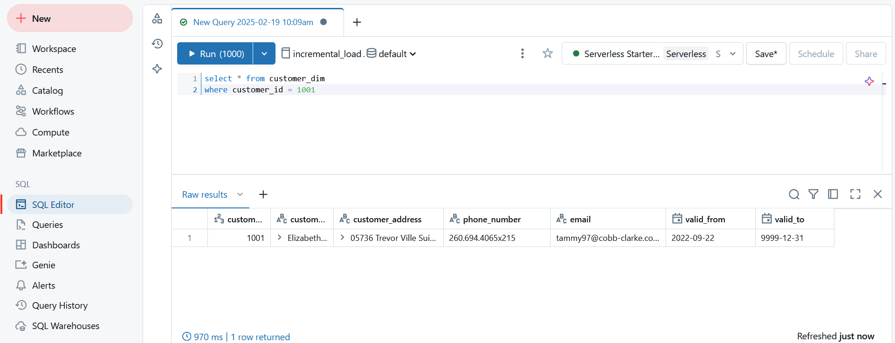
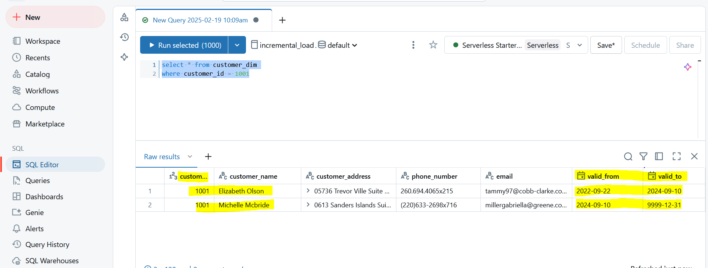

# Travel Booking SCD2 Merge

## Project Overview
This project implements an **incremental load with Slowly Changing Dimension Type 2 (SCD2) merge** for a travel booking system. It ingests booking and customer data, processes it using **PySpark on Databricks**, and maintains a historical record of customer changes using **SCD Type 2**.

## Technologies Used
- **Azure Data Lake Storage (ADLS)**
- **PySpark**
- **Databricks**
- **Delta Lake**
- **Databricks Workflows**
- **GitHub**

## Architecture Diagram


---

## Implementation Details

### **1. Data Sources**
- **Booking Data** (stored in `booking_data` folder in ADLS)
- **Customer Data** (stored in `customer_data` folder in ADLS)
```python
from pyspark.sql.functions import col, lit, current_timestamp, sum as _sum
from delta.tables import DeltaTable
# Get job parameters from Databricks
date_str = dbutils.widgets.get("arrival_date")
# date_str = "2024-07-25"

# Define file paths based on date parameter
booking_data = f"abfss://landingzone@devanshlandingzn.dfs.core.windows.net/booking_data/bookings_{date_str}.csv"
customer_data = f"abfss://landingzone@devanshlandingzn.dfs.core.windows.net/customer_data/customers_{date_str}.csv"
print(booking_data)
print(customer_data)
```

### **2. Data Ingestion & Transformation**
- Read booking and customer data from ADLS using PySpark.
- Join booking data with customer data on `customer_id`.
- Compute `total_cost` as `amount - discount`.
- Aggregate by `booking_type` and `customer_id` to compute:
  - `total_amount_sum`
  - `total_quantity_sum`

```python
# Read booking data
booking_df = spark.read \
    .format("csv") \
    .option("header", "true") \
    .option("inferSchema", "true") \
    .option("quote", "\"") \
    .option("multiLine", "true") \
    .load(booking_data)

booking_df.printSchema()
display(booking_data)

# Read customer data for scd2 merge
customer_df = spark.read \
    .format("csv") \
    .option("header", "true") \
    .option("inferSchema", "true") \
    .option("quote", "\"") \
    .option("multiLine", "true") \
    .load(customer_data)

customer_df.printSchema()
display(customer_df)


# Add ingestion timestamp to booking data
booking_df_incremental = booking_df.withColumn("ingestion_time", current_timestamp())

# Join booking data with customer data
df_joined = booking_df_incremental.join(customer_df, "customer_id")

# Business transformation: calculate total cost after discount and filter
df_transformed = df_joined \
    .withColumn("total_cost", col("amount") - col("discount")) \
    .filter(col("quantity") > 0)

# Group by and aggregate df_transformed
df_transformed_agg = df_transformed \
    .groupBy("booking_type", "customer_id") \
    .agg(
        _sum("total_cost").alias("total_amount_sum"),
        _sum("quantity").alias("total_quantity_sum")
    )
```

### **3. Fact Table Processing (booking_fact)**
- **Step 1:** Check if `booking_fact` exists.
- **Step 2:** If the table exists:
  - Read existing fact table.
  - Append new aggregated data.
  - Recompute aggregates for `booking_type` and `customer_id`.
- **Step 3:** If the table does not exist:
  - Create `booking_fact` with aggregated data.
- **Step 4:** Write the final aggregated data to the fact table using `overwriteSchema=True`.

```python
# Check if the Delta table exists
fact_table_path = "incremental_load.default.booking_fact"
fact_table_exists = spark._jsparkSession.catalog().tableExists(fact_table_path)


if fact_table_exists:
    # Read the existing fact table
    df_existing_fact = spark.read.format("delta").table(fact_table_path)
    
    # Combine the aggregated data
    df_combined = df_existing_fact.unionByName(df_transformed_agg, allowMissingColumns=True)
    
    # Perform another group by and aggregation on the combined data
    df_final_agg = df_combined \
        .groupBy("booking_type", "customer_id") \
        .agg(
            _sum("total_amount_sum").alias("total_amount_sum"),
            _sum("total_quantity_sum").alias("total_quantity_sum")
        )
else:
    # If the fact table doesn't exist, use the aggregated transformed data directly
    df_final_agg = df_transformed_agg

display(df_final_agg)

# Write the final aggregated data back to the Delta table
df_final_agg.write \
    .format("delta") \
    .mode("overwrite") \
    .option("overwriteSchema", "true") \
    .saveAsTable(fact_table_path)
```

### **4. Dimension Table Processing (customer_dim) - SCD Type 2**
- **Step 1:** Check if `customer_dim` exists.
- **Step 2:** If the table exists:
  - Perform a **merge operation** on `customer_id` where `valid_to = '9999-12-31'`.
  - When a match is found, update `valid_to` with `valid_from` of the incoming record.
  - Insert new records with updated `valid_from` and `valid_to` values.
- **Step 3:** If the table does not exist:
  - Overwrite table with new customer data.
```python
scd_table_path = "incremental_load.default.customer_dim"
scd_table_exists = spark._jsparkSession.catalog().tableExists(scd_table_path)
# Check if the customers table exists
if scd_table_exists:
    # Load the existing SCD table
    scd_table = DeltaTable.forName(spark, scd_table_path)
    display(scd_table.toDF())
    
    # Perform SCD2 merge logic
    scd_table.alias("scd") \
        .merge(
            customer_df.alias("updates"),
            "scd.customer_id = updates.customer_id and scd.valid_to = '9999-12-31'"
        ) \
        .whenMatchedUpdate(set={
            "valid_to": "updates.valid_from",
        }) \
        .execute()

    customer_df.write.format("delta").mode("append").saveAsTable(scd_table_path)
else:
    # If the SCD table doesn't exist, write the customer data as a new Delta table
    customer_df.write.format("delta").mode("overwrite").saveAsTable(scd_table_path)
```
---

## **Project Workflow**
### **Step 1: Setup Azure Resources**
- Create **Databricks workspace**.
- Set up **Azure Data Lake Storage (ADLS)**.
- Create folders:
  - `booking_data` (for booking CSVs)
  - `customer_data` (for customer CSVs)






### **Step 2: Run Data Pipeline**
- **Read Booking and Customer Data:**
  - Load data into PySpark DataFrames.
  - Apply transformations (join, aggregations, calculations).
- **Write to Fact and Dimension Tables:**
  - Merge and update `booking_fact`.
  - Perform SCD2 merge in `customer_dim`.
- **Workflow Execution:**
  - Automate process using Databricks Workflows.
  - 


### **Step 3: Validate Data**
- Check `booking_fact` table for correct aggregations.
- Check `customer_dim` table for historical records (SCD2 merge).







## **How to Run the Project**
1. Clone the repository and configure Databricks.
2. Upload data files to `booking_data` and `customer_data` folders in ADLS.
3. Workflow will trigger automatically based on file arrival.
4. Validate the processed data in `booking_fact` and `customer_dim` tables.

---

## **Project Folder Structure**
```
├── notebooks/            # Databricks Notebooks
│   ├── booking_fact.ipynb
│   ├── customer_dim_scd2.ipynb
│
├── data/                 # Sample datasets
│   ├── booking_sample.csv
│   ├── customer_sample.csv
│
│
├── README.md             # Main documentation
```

---

## **Future Enhancements**
- Implement **SCD Type 2 optimization** with partitioning.
- Automate deployment using **Databricks Repos & GitHub Actions**.
- Improve **error handling & monitoring** using Databricks Jobs.

---

## **Contact**
For queries or contributions, contact [Your Name] at [Your Email].
